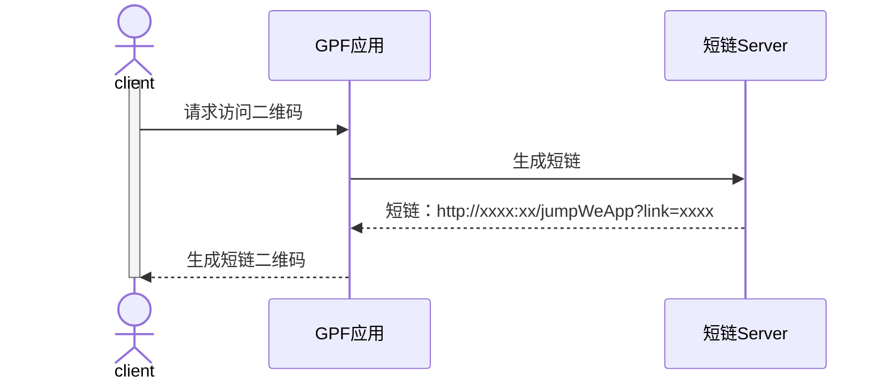
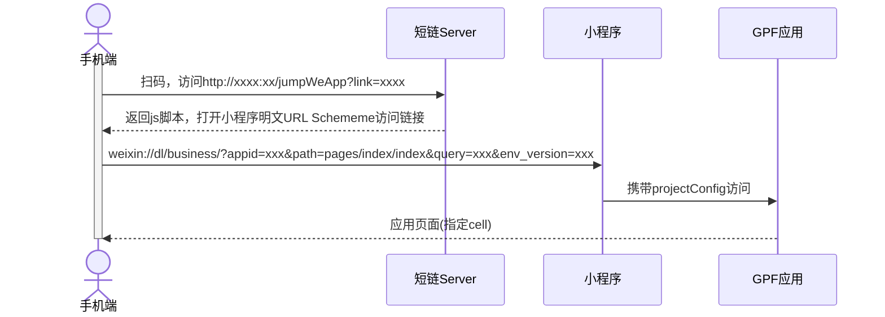

# 1.概述

二维码打开小程序的有两种方式：

1. **明文 URL Scheme**：通过构建http短链二维码，执行js脚本获取明文 URL Scheme访问链接，如何构建短链可查看《短链管理.pdf》文档。

2. **小程序码**：生成小程序码短链访问（未支持，需要对接小程序API编写生成小程序码的接口）

   > [!NOTE]
   >
   > 两者体感上区别：明文URL Scheme在扫码后会弹出提示是否打开小程序，小程序码可直接进入小程序
   >
   > 明文URL Scheme需要小程序开启明文schema访问权限

# 2.明文 URL Scheme访问

**短链二维码请求时序图**



> [!NOTE]
>
> *以上短链Server和GPF应用可在同一个服务内*

短链生成代码样例：

```java

String wsUrl = "";//用于生成小程序访问的projectConfig的websocket地址，为目标应用的websocket
String cell = IAppFeLoginPage.class.getName();//目标应用的服务cell，默认是登录页，有特殊需求可自定义设置
String systemUuid = "";//目标应用的uuid
String appCode = "";//目标应用的编号
String appSessionKey = "";//目标应用的会话ID
String appId = "";//小程序的appId
String envVersion = "";//访问的小程序环境版本dev、trival、release
String shortLinkServerUrl = "http://xxx";//提供短链服务的url，如果GPF应用和短链服务为同一个GPF服务中可使用http://xxx提供短链服务

Map<String,Object> projectConfig = new LinkedHashMap<>();
projectConfig.put("url", wsUrl);
projectConfig.put("cell", cell);
//小程序访问时携带的初始化参数，除以下参数可自定义携带的参数，在目标应用中通过PanelContext.getAppInfo获取
//注意：明文URL Scheme的query参数长度限制为256个字符，initParam不可传递过多参数
Map<String,Object> initParam = new LinkedHashMap<>();
initParam.put(AppCacheUtil.InitParam_SystemUuid, shareAppSetting.getUuid());
initParam.put(AppCacheUtil.InitParam_AppCode, shareAppSetting.getName());
initParam.put(AppCacheUtil.InitParam_AppSessionKey, shareAppSetting.getSessionKey());
//详情页不使用JDV的登录页
initParam.put(AppCacheUtil.InitParam_UseJDVPage, false);

projectConfig.put("initParam", initParam);
//生成小程序明文URL Scheme
String weAppLink = IShortLinkService.get().buildMiniProgramLink(appId, projectConfig,envVersion);
//生成Http短链
String shareLink = IShortLinkService.get().buildMiniProgramShortLink(shortLinkServerUrl,weAppLink);
```

> [!CAUTION]
>
> 明文URL Scheme的query参数长度限制为256个字符，initParam不可传递过多参数


**二维码打开小程序时序图**





