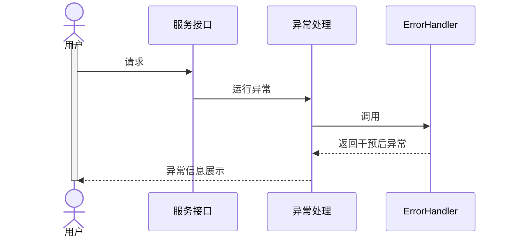

# 异常处理干预

**版本要求：**

GPF >= 7.5.5

basic >=2.0.6

## 1.异常处理干预流程




​	目前包含的服务接口类型：

- JDF前端请求接口
- Cell服务代理接口
- 微服务代理接口
- Http请求接口（后续补充）

## 2.干预方法

### 2.1 定义业务异常基类

继承cmn.exception.BaseException，示例如下：

```java
package gpf.study.errorhandler;

import cmn.enums.ErrorLevel;
import cmn.exception.BaseException;
import cmn.exception.ErrorInfoInterface;
/**
 *	演示继承BaseException的业务异常，带有错误码和错误级别定义
 */
public class StudyBizException extends BaseException{

	/**
	 * 
	 */
	private static final long serialVersionUID = -5312334256208309217L;

	public StudyBizException(ErrorInfoInterface errorInfo) {
		super(errorInfo);
	}
	
	public StudyBizException(ErrorInfoInterface errorInfo,Throwable cause) {
		super(errorInfo,cause);
	}
	
	public StudyBizException(ErrorLevel errorLevel,String errorCode,String message) {
		super(errorLevel, errorCode, message);
	}
	public StudyBizException(ErrorLevel errorLevel,String errorCode,String message,Throwable cause) {
		super(errorLevel, errorCode, message);
	}
}

```

### 2.2 实现异常处理接口

实现cmn.exception.handler.ErrorHandler接口，示例如下：

```java
package gpf.study.errorhandler;

import java.util.regex.Matcher;
import java.util.regex.Pattern;

import com.kwaidoo.ms.tool.ToolUtilities;
import com.leavay.dfc.gui.LvUtil;

import cmn.anotation.ClassDeclare;
import cmn.enums.ErrorLevel;
import cmn.exception.BaseException;
import cmn.exception.ErrorInfoInterface;
import cmn.exception.handler.ErrorHandler;
@ClassDeclare(label = "异常处理类代码样例"
,what="异常处理类代码样例，演示如何对服务抛出的异常进行干预包装成业务可以读懂的异常，以下定义了错误码枚举类示例，具体可根据实际项目需要，调整为模型管理配置的错误码和匹配规则"
, why = ""
, how = ""
,developer="陈晓斌"
,version = "1.0"
,createTime = "205-02-14"
,updateTime = "205-02-14")
public class StudyErrorHandler implements ErrorHandler{
	
	/**
	 * 
	 */
	private static final long serialVersionUID = 7752892622107640444L;

	/**
	 * 错误码枚举类定义示例
	 * 带有错误级别、错误码、错误描述
	 */
	public static enum StudyErrorInfo implements ErrorInfoInterface{
		
		ConnectionFail(ErrorLevel.ERROR,"ERROR_0001","数据库连接异常"),
		TableNotFound(ErrorLevel.INFO,"ERROR_0002","表不存在"),
		Unkown(ErrorLevel.WARN,"ERROR_9999","未知异常")
		;
		
		String errorCode;
		ErrorLevel errorLevel;
		String errorMsg;
		private StudyErrorInfo(ErrorLevel level,String errorCode,String errorMsg) {
			this.errorLevel = level;
			this.errorCode = errorCode;
			this.errorMsg = errorMsg;
		}

		@Override
		public String getErrorCode() {
			return errorCode;
		}

		@Override
		public ErrorLevel getErrorLevel() {
			return errorLevel;
		}

		@Override
		public String getErrorMsg() {
			return errorMsg;
		}
		
	}

	@Override
	public Throwable handle(Throwable exception) {
		LvUtil.trace("处理异常：" + exception);
		String message = exception.getMessage();
		LvUtil.trace("message：" + message);
		String exceptionStack = ToolUtilities.getFullExceptionStack(exception);
		LvUtil.trace("exceptionStack：" + exceptionStack);
		//如果是异常基类，可以选择是原封不动抛出，或者是重新转译后抛出
		if(exception instanceof BaseException) {
			return new StudyBizException(((BaseException) exception).getErrorLevel(), ((BaseException) exception).getErrorCode(), exception.getMessage(), exception.getCause());
		}
		if(find(exceptionStack,"PSQLException:(.+)timed out")) {
			return new StudyBizException(StudyErrorInfo.ConnectionFail,exception);
		}else if(find(exceptionStack,"PSQLException: 错误: 关系 (.+) 不存在")) {
			return new StudyBizException(StudyErrorInfo.TableNotFound,exception);
		}else {
			return new StudyBizException(StudyErrorInfo.Unkown,exception);
		}
	}
	/**
	 * 检测堆栈日志是否匹配正则
	 * @param errorStack
	 * @param regexStr
	 * @return
	 */
	public boolean find(String errorStack,String regexStr) {
		Pattern regex = Pattern.compile(regexStr, Pattern.CASE_INSENSITIVE | Pattern.UNICODE_CASE | Pattern.DOTALL | Pattern.MULTILINE);
		Matcher regexMatcher = regex.matcher(errorStack);
		return regexMatcher.find();
	}
	
	public static void main(String[] args) {
		String errorStack = "org.postgresql.util.PSQLException: 错误: 关系 测试表 不存在\r\n" + 
				"	at cell.gpf.study.errorhandler.IStudyErrorHandler.testErrorHande";
		 String regexStr = "PSQLException: 错误: 关系 (.+) 不存在";
		System.out.println(new StudyErrorHandler().find(errorStack, regexStr));
	}

}

```

## 3. 生效干预配置

​	提供三种生效配置方式：

​	**1.全局异常处理干预配置：**设置整个平台的全局异常处理干预配置，在未指定特定的异常干预配置前使用

​	配置服务参数 **cmn.exception.globalhandler** 全局常处理接口类

​	取值：gpf.study.errorhandler.StudyErrorHandler


测试异常干预处理代码样例如下：

```java
package cell.gpf.study.errorhandler;

import bap.cells.Cells;
import cell.CellIntf;
import gpf.dc.basic.fe.component.BaseFeActionIntf;
import gpf.dc.basic.param.view.BaseFeActionParameter;

public interface IStudyErrorHandler <T extends BaseFeActionParameter> extends CellIntf,BaseFeActionIntf<T>{

	public static IStudyErrorHandler get() {
		return Cells.get(IStudyErrorHandler.class);
	}
	
	@Override
	default Object execute(T input) throws Exception {
		testErrorHander("测试表");
		return null;
	}
	
	
	@Override
	default Class<? extends T> getInputParamClass() {
		return (Class<? extends T>) BaseFeActionParameter.class;
	}
	
	default void testErrorHander(String table) throws Exception {
		throw new Exception("org.postgresql.util.PSQLException: 错误: 关系 "+table+" 不存在");
	}
}

```

调用效果：


​	**2.应用异常干预配置：**可指定应用上的异常干预配置，优先级高于全局异常干预配置

​	

​	

**3.构建服务代理接口时传入ErrorHandler实例:**

```java
package gpf.study.errorhandler;

import cell.gpf.study.errorhandler.IStudyErrorHandler;
import cmn.util.ProxyUtil;
/**
 * 服务代理类样例，代理类通过单例方式构建，避免反复构建动态代理类的开销
 */
public class StudyProxyService {

	private static IStudyErrorHandler testMgr = null;

	public synchronized static IStudyErrorHandler getTestMgr() {
		if (testMgr == null) {
			testMgr = (IStudyErrorHandler) ProxyUtil.newProxyInstance(IStudyErrorHandler.get(),
					new StudyErrorHandler());
		}
		return testMgr;
	}

	public static void testErrorHandler() throws Exception {
		IStudyErrorHandler testMgr = getTestMgr();
		testMgr.testErrorHander("测试表");
	}
}

```

调用效果如下：


