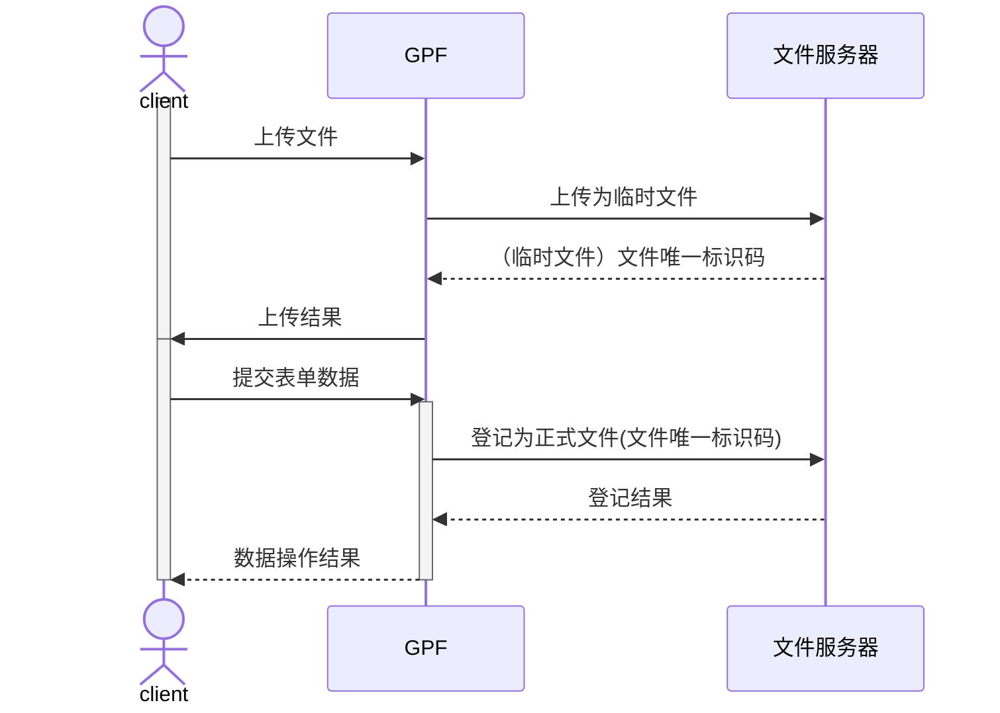
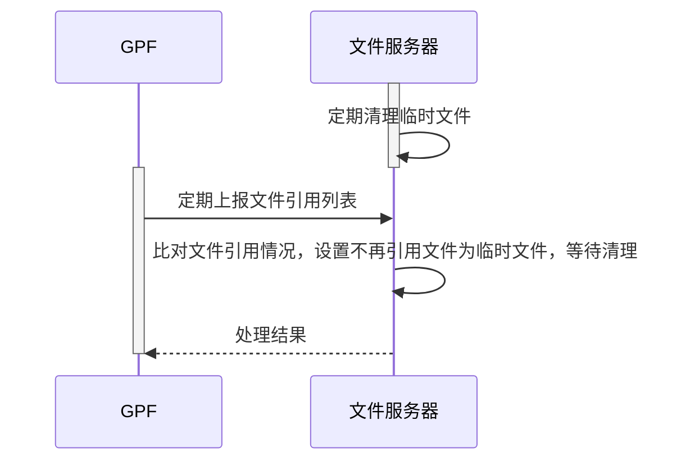

# GPF-网络附件功能

**版本要求：**

GPF >= 7.6.6

basic >=2.2.6

## 1.网络附件处理流程

GPF提供新的属性类型（网络附件），通过设置该类型，上传文件通过GPF中转到文件服务器，避免大量附件存储在GPF数据库影响GPF的操作和数据库备份。以下是文件服务的相关时序图：

**客户端文件上传时序：**




**垃圾文件清理机制：**




## 2.GPF的配置参数

在starter.xml文件中，添加了文件服务连接的相关配置参数

```xml
	<starter key="gpf" label="GPF" desc="GPF服务" class="gpf.GpfStarter" optional="false" enable="true">
		...

		<param key="fileServer.type" label="文件服务类型，本地(local)、远程(remote)" type="string" value="remote"/>
		<param key="fileServer.localFileRootFolder" label="本地文件服务的文件根目录，文件服务类型时(local)时配置，可以是绝对路径，注意不要误删文件目录" type="string" value="../LocalFileServer"/>
		<param key="fileServer.fileServerCell" label="本地文件服务Cell" type="string" value="cell.fileserver.ILocalFileServer"/>
		<param key="fileServer.remote.url" label="远程服务地址，格式：http://192.168.1.1:8090，文件服务类型为remote时配置" type="string" value="http://127.0.0.1:8090"/>
				<param key="fileServer.account" label="文件服务账号，文件服务类型为remote时配置" type="string" value = "admin"/>
		<param key="fileServer.secret" label="文件服务secret，文件服务类型为remote时配置" type="string" value = "c5f54f0f_8201_468b_baae_f8cfddcf323a"/> 
	</starter>
```

其中*fileServer.type*支持配置为**local**或**remote**

> [!TIP]
>
> **推荐使用remote，特别是在生产环境，GPF服务应与文件服务分开部署，避免因为GPF服务的升级操作误删文件服务目录**

当设置为local时，GPF与文件服务器在同个进程内启动，需要配置本地文件服务的文件根目录（*fileServer.localFileRootFolder*），该目录支持配置绝对路径，可以指定不在GPF服务目录底下的其他目录，避免在升级GPF服务时将该目录误删除。

当设置为remote时（**推荐设置**），需要配置*fileServer.remote.url*（远程服务地址）、*fileServer.account*（文件服务账号）、*fileServer.secret*（文件服务secret）

> [!CAUTION]
>
> **文件服务器必须为每个GPF服务设置独立账号，因为GPF会定时上报引用的文件列表，文件服务器将清除不在GPF上引用的文件。**
>
> **同时要注意文件服务器数据库和文件目录的灾备。**
>
> 

其他配置参数

| 参数                           | 说明                         | 默认值 |
| ------------------------------ | ---------------------------- | ------ |
| fileServer.report.intervalHour | 定时上报时间间隔，单位：小时 | 1      |

## 3.GPF使用说明

属性配置：


使用样例：


## 4.代码操作样例

设置表单值：

```java
//上传网络附件
WebAttachData webAttach = IFormMgr.get().uploadWebAttach("test.txt", "测试上传附件".getBytes());
List<WebAttachData> lstWebAttach = CollUtil.newArrayList(webAttach);
form.setAttrValue(StudyFormMockConst.WebAttachField, lstWebAttach);
```

查询网络附件

```
//读取网络附件
List<WebAttachData> lstWebAttach = form.getWebAttachs(StudyFormMockConst.WebAttachField);
for(WebAttachData webAttach : lstWebAttach) {
	byte[] content = IFormMgr.get().downloadWebAttach(webAttach.getFileUuid());
}
```

获取网络附件分享链接

```
//读取网络附件分享链接
for(WebAttachData webAttach : lstWebAttach) {
	String shareUrl = webAttach.getShareFileUrl();
}
```


## 5.文件服务管理

通过以下project_config.json配置可进入文件服务首页，或通过开启文件服务的GPF服务可查看文件服务内容

```json
{
    "projectName": "文件服务器",
    "showBuildLogin": true,
    "showUrlInput": true,
    "showCellInput": true,
    "urlByWebNavigator": false,
    "urlByServer": false,
    "url": "ws://127.0.0.1:2020",
    "cell": "cell.fe.fileserver.IFeFileServerHomePage",
    "initParam": {},
    "lstUrl": [{
        "ws://sit.kwaidoo.com:2022": "ws://sit.kwaidoo.com:2022",
        "_OBJECT_TYPE_": "fe.cmn.data.PairDto"
    }],
    "dev": false,
    "printAbilityLog": true,
    "useCDN": false,
    "version": "3.7.0"
}
```

gpfdc操作入口：


在文件服务中可管理文件服务账号，切换文件服务账号可查询该账号下的文件列表，以及近期的文件服务日志（默认保留5天）


获取文件分享链接


其他服务配置参数

| 参数                                | 说明                           | 默认值 |
| ----------------------------------- | ------------------------------ | ------ |
| fileServer.fileOpLog.keepHistoryDay | 操作日志保留历史时间，单位：天 | 5      |

