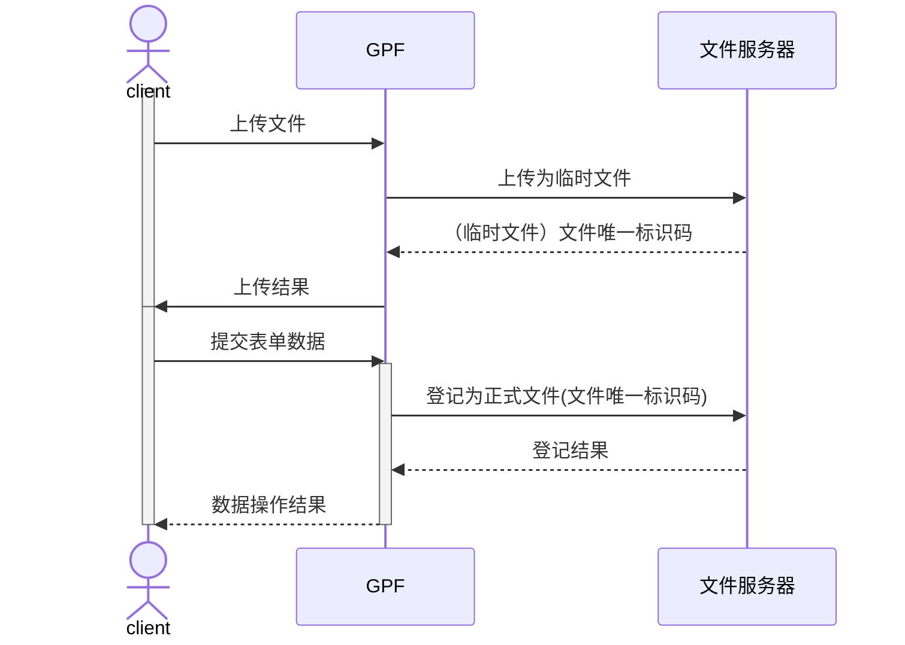
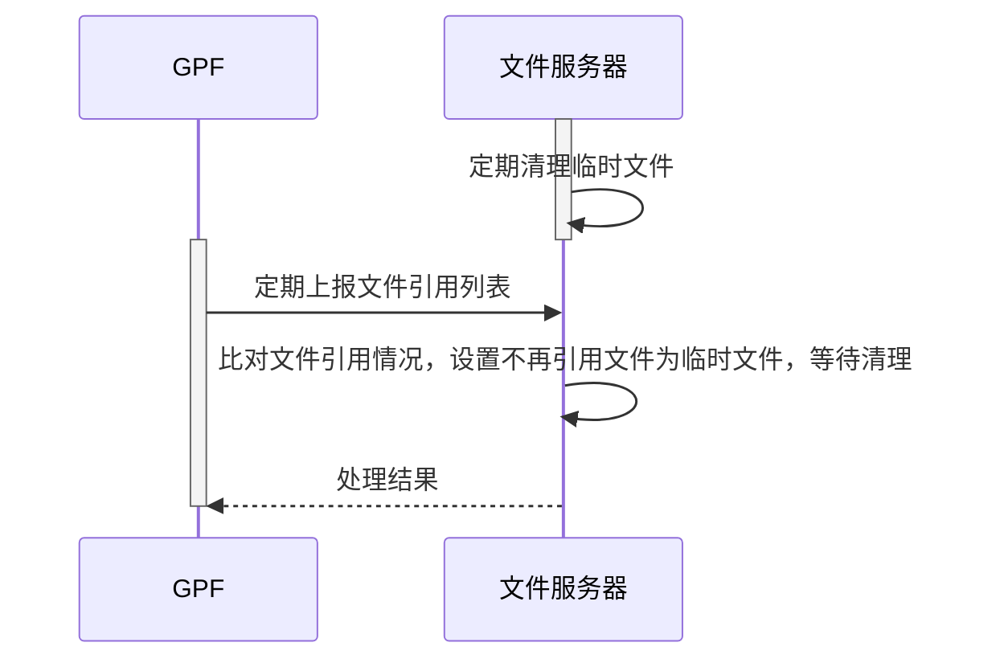

**客户端文件上传时序：**

```mermaid
sequenceDiagram
actor client
participant GPF
participant 文件服务器
activate client
client->>GPF:上传文件
GPF->>文件服务器:上传为临时文件
文件服务器-->>GPF:（临时文件）文件唯一标识码
GPF->>client:上传结果
deactivate client

activate client
client->>GPF:提交表单数据
activate GPF
GPF->>文件服务器:登记为正式文件(文件唯一标识码)
文件服务器-->>GPF:登记结果
GPF-->>client:数据操作结果
deactivate GPF
deactivate client

```

**野文件清理机制：**

```mermaid
sequenceDiagram

participant GPF
participant 文件服务器

activate 文件服务器
文件服务器->>文件服务器:定期清理临时文件
deactivate 文件服务器

activate GPF
GPF->>文件服务器:定期上报文件引用列表
文件服务器->>文件服务器:比对文件引用情况，设置不再引用文件为临时文件，等待清理
文件服务器-->>GPF:处理结果
deactivate GPF
```

